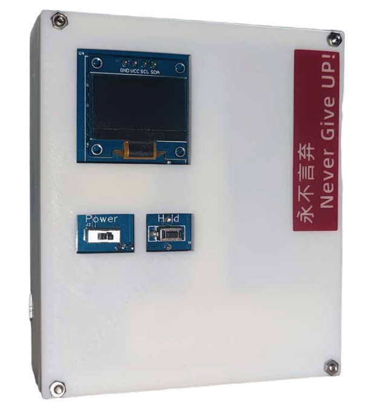
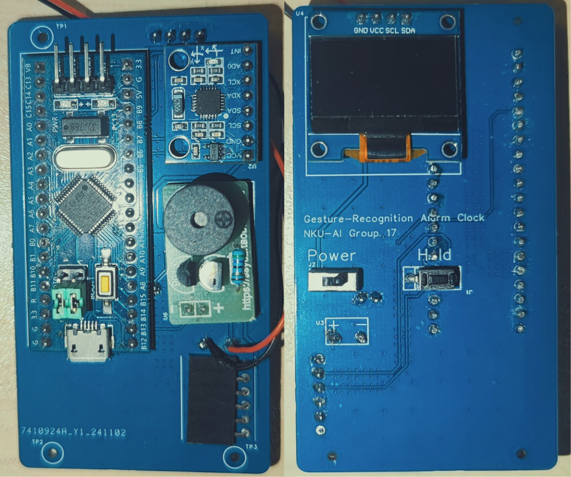

# 基于端侧动作识别的强制唤醒闹钟
本项目立足于生活实际问题进行设计，旨在制作一款通过完成相应动作任务关闭的强制唤醒闹钟，帮助用户迅速清醒。其中，动作识别功能由卷积神经网络完成，利用高效的Edge - AI框架完成了其在STM32上的部署，实现端侧推理。此外，闹钟还具备蓝牙功能，可拓展性较高。

## 鸣谢
- 本项目受开源项目[STM32_CyberryPotter_ElectromagicWand_Basic_Project](https://github.com/Hillplain/STM32_CyberryPotter_ElectromagicWand_Basic_Project)启发，并基于其与开源项目[NNOM](https://github.com/majianjia/nnom)开发，感谢相关开发者做出的贡献。
- 本项目仅用于学习交流等非商业用途，如有侵权，立刻删除。

## 设计背景
- 你是否有熬夜或赖床的习惯？是否有因下意识关闭闹钟而迟到的经历？是否会被室友反反复复的闹钟吵醒？
- 是否期望有一款闹钟，能使你不再被赖床和拖延困扰，关掉闹钟即可清醒；能让舍友在闹钟响一次之后，就会立刻起床？

## 系统框架
|模式|流程|
| ---- | ---- |
|正常工作模式（单片机）|显示屏、加速度计、蜂鸣器、滤波处理、蓝牙、时钟协同工作|
|数据采集与训练模式（PC）|自建数据集、模型训练、训练好的模型、分类效果测试，最终将训练好的模型部署到单片机|

## 功能介绍
1. **设置闹钟时间**：通过蓝牙向设备发送消息设置。
2. **响铃暂停操作**：闹钟响铃时，单击Hold键，响铃暂停。
3. **动作关闭闹钟**：在接下来的3s内根据屏幕提示完成动作。每次随机检验1 - 2组动作，如果顺利完成闹钟将关闭，否则持续响铃。
    >目前支持的动作：
    >水平下移、水平上移、画字母e、画字母b、画字母v

## 产品特点
1. **成本优势**：使用低成本的STM32F103系列芯片即可实现预定效果。
2. **数据自主**：所需数据集规模小，可自主采集，无需额外成本。
3. **拓展性强**：配备蓝牙模块，能够与其他设备通信，具有丰富的拓展可能。

## 如何使用
### 硬件
#### 材料清单
1. STM32F103C8T6单片机
2. 加速度计MPU6050
3. 有源音乐模块
4. 0.96寸OLED显示屏（I2C）
5. 电源管理模块（5V输出）
6. HC-05蓝牙模块（串口通信）
7. 拨动开关、按键、六针脚排母各一个

#### 硬件连接
请根据PCB上的丝印焊接，效果如下：

>蓝牙模块插在排母上，电源管理模块未在PCB上画出，需使用导线连接至PCB预留焊盘。

具体连接位置:
>屏幕安装位置：SCL--PB10; SDA--PB11
串口安装位置：PA9(TX)--RX; PA10(RX)--TX
加速度计安装位置：SCL--PB6; SDA--PB7; INT--PB5
蜂鸣器安装位置：PA7(OD输出)
按键安装位置：PA0--3V3之间

注：5V供电通过最小系统板转换为3V3，为其余模块供电，**仅蓝牙模块为5V直供**。

### 软件
#### 环境配置

- Python环境：

    创建一个Python3.9环境  `conda create --name py39_env python=3.9`并安装项目依赖 `pip install -r requirements.txt`

- Keil环境：
  
  keil版本：keil5
  
  编译器版本：Arm Compiler6.7
  
- 可能存在的问题
    
    编译报错：`C:/Users/xxx/AppData/Local/arm/packs/Keil/STM32F1xx_DFP/2.4.1/Device/StdPeriph_Driver/src/misc.c:131:11: error: no member named 'IP' in 'NVIC_Type'`

    这是项目使用到的STM32F1XX_DFP2.4.1版本库存在的一个问题，这个有问题的文件安装在以下目录，默认是只读的，请在这个目录下将其只读选项取消勾选
    `C:/Users/xxx/AppData/Local/arm/packs/Keil/STM32F1xx_DFP/2.4.1/Device/StdPeriph_Driver/src/misc.c`
        
    （AppData文件夹默认是隐藏的，请先设置显示隐藏文件）
        
    请将device库中将misc.c文件里的上述代码（131行）修改为
    `NVIC->IPR[NVIC_InitStruct->NVIC_IRQChannel] = tmppriority`

#### 如何训练

1. 使用[脚本](/Software/CNN/Serial_Read.py)收集数据
   - 首先需要将config.h文件中的`SYSTEM_MODE_DATA_COLLECT`解除注释
   - 完成以上操作后单片机将进入数据打印模式而非推理模式
2. 运行[模型训练](/Software/CNN/CNNTrainRaw.py)脚本
   - 运行训练脚本你将得到一个.h5的模型文件和一个.h的c头文件
   - .h5文件用于在[串口模型测试脚本](/Software/CNN/CNNTestSerialRaw.py)对未量化的模型进行测试
   - .h文件是单片机用于编译模型所需要的文件
3. 打开[Keil工程](/Software/project.uvprojx)编译、烧录
4. 在不改变动作时，无需重复训练，该项目中包含[训练好的模型文件](/Software/CNN/model.h5)和对应的[量化版本](/Software/CNN/weights.h)
